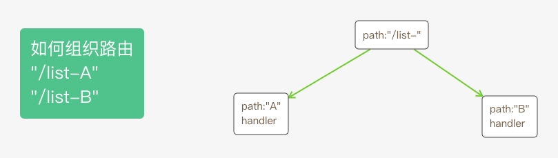

# gin如何实现HttpServer

## 如何构建一个Http Server

golang标准库封装了一个http库，可以用于构建Http Server。参看下面的代码

```Golang
package main

import "net/http"
import "fmt"

type MyHandler struct {}

func (that *MyHandler) ServeHTTP(w http.ResponseWriter, req *http.Request) {
	fmt.Println("path is ", req.URL.Path)
	switch req.URL.Path {
	case "/list":
		w.WriteHeader(200)
		fmt.Fprintf(w, "%s", "you request list")
	case "/form":
		w.WriteHeader(200)
		fmt.Fprintf(w, "%s", "you request form")
	default:
		w.WriteHeader(400)
		fmt.Fprintf(w, "%s", "not found your request")
	}
}

func main() {
  // 创建一个http.Server对象
	server := http.Server{
		Addr: ":8080",
		Handler: &MyHandler{},
	}
  // 调用http.Server对象的ListenAndServe方法
	server.ListenAndServe()
	fmt.Println("Server is running on port 8080")
}
```

http提供了另外一种简洁一些的写法

```Golang
package main

import "net/http"
import "fmt"

type MyHandler struct {}

func (that *MyHandler) ServeHTTP(w http.ResponseWriter, req *http.Request) {
	fmt.Println("path is ", req.URL.Path)
	switch req.URL.Path {
	case "/list":
		w.WriteHeader(200)
		fmt.Fprintf(w, "%s", "you request list")
	case "/form":
		w.WriteHeader(200)
		fmt.Fprintf(w, "%s", "you request form")
	default:
		w.WriteHeader(400)
		fmt.Fprintf(w, "%s", "not found your request")
	}
}

func main() {
	http.ListenAndServe(":8080", &MyHandler{})
	fmt.Println("Server is running on port 8080")
}
```

第二种写法简洁一些，实质上是第一种写法。在http.ListenAndServe构建了http.Server对象，然后调用http.Server对象的ListenAndServe方法，http.ListenAndServe的源码如下：
```Golang
// ListenAndServe always returns a non-nil error.
func ListenAndServe(addr string, handler Handler) error {
	server := &Server{Addr: addr, Handler: handler}
	return server.ListenAndServe()
}
```

## gin

### 怎么使用gin来构建一个Http Server

```Golang
package main

import "github.com/gin-gonic/gin"

func main() {
  r := gin.Default()
  
	r.GET("/list", func(c *gin.Context) {
		c.JSON(200, "you request list")
	})
	r.GET("/form", func(c *gin.Context) {
		c.JSON(200, "you request form")
	})
	r.Run(":8080") // listen and serve on 0.0.0.0:8080 (for windows "localhost:8080")
}
```

### gin是如何组织路由的

#### 一、Engine结构体

Engine是gin框架的实例，包含了muxer, middleware and configuration settings。
可以通过调用``New()``和``Default()``方法来创建

```Golang
// Engine is the framework's instance, it contains the muxer, middleware and configuration settings.
// Create an instance of Engine, by using New() or Default()
type Engine struct {
	RouterGroup

	// Enables automatic redirection if the current route can't be matched but a
	// handler for the path with (without) the trailing slash exists.
	// For example if /foo/ is requested but a route only exists for /foo, the
	// client is redirected to /foo with http status code 301 for GET requests
	// and 307 for all other request methods.
	RedirectTrailingSlash bool

	// If enabled, the router tries to fix the current request path, if no
	// handle is registered for it.
	// First superfluous path elements like ../ or // are removed.
	// Afterwards the router does a case-insensitive lookup of the cleaned path.
	// If a handle can be found for this route, the router makes a redirection
	// to the corrected path with status code 301 for GET requests and 307 for
	// all other request methods.
	// For example /FOO and /..//Foo could be redirected to /foo.
	// RedirectTrailingSlash is independent of this option.
	RedirectFixedPath bool

	// If enabled, the router checks if another method is allowed for the
	// current route, if the current request can not be routed.
	// If this is the case, the request is answered with 'Method Not Allowed'
	// and HTTP status code 405.
	// If no other Method is allowed, the request is delegated to the NotFound
	// handler.
	HandleMethodNotAllowed bool
	ForwardedByClientIP    bool

	// #726 #755 If enabled, it will thrust some headers starting with
	// 'X-AppEngine...' for better integration with that PaaS.
	AppEngine bool

	// If enabled, the url.RawPath will be used to find parameters.
	UseRawPath bool

	// If true, the path value will be unescaped.
	// If UseRawPath is false (by default), the UnescapePathValues effectively is true,
	// as url.Path gonna be used, which is already unescaped.
	UnescapePathValues bool

	// Value of 'maxMemory' param that is given to http.Request's ParseMultipartForm
	// method call.
	MaxMultipartMemory int64

	// RemoveExtraSlash a parameter can be parsed from the URL even with extra slashes.
	// See the PR #1817 and issue #1644
	RemoveExtraSlash bool

	delims           render.Delims
	secureJsonPrefix string
	HTMLRender       render.HTMLRender
	FuncMap          template.FuncMap
	allNoRoute       HandlersChain
	allNoMethod      HandlersChain
	noRoute          HandlersChain
	noMethod         HandlersChain
	pool             sync.Pool
	trees            methodTrees
}
```
#### 二、如何注册路由

通过调用```r.HttpMethod(path, ginRouterHandler)```方法来注册路由，r是``Engine``结构体的对象，``HttpMethod``表示``GET、POST、PUT``等方法。

``Engine``本身没有实现``HttpMethod``，而是继承了``RouterGroup``，``RouterGroup``实现了这些方法。

``RouterGroup``用来配置router，关联了path和handlers。下面是``RouterGroup``的结构。

```Golang
// RouterGroup is used internally to configure router, a RouterGroup is associated with
// a prefix and an array of handlers (middleware).
type RouterGroup struct {
	Handlers HandlersChain    // HandlersChain是ginHandler的数组，参看下面的代码
	basePath string
	engine   *Engine
	root     bool
}
```

了解怎么注册路由之前，先了解``Engine``结构体的中``trees``属性，``trees``属性的类型是``methodTrees``。下面是``methodTrees``的结构。

```Golang
type node struct {
	path      string
	indices   string
	children  []*node
	handlers  HandlersChain
	priority  uint32
	nType     nodeType
	maxParams uint8
	wildChild bool
	fullPath  string
}

type methodTree struct {
	method string
	root   *node
}

type methodTrees []methodTree
```

``methodTree``结构体有``method``和``root``属性。``method``是``"GET"、"POST"``等字符串，可参看标准库http.method文件。
``root``是一个树的根结点，该树用于维护``method``指定的请求方法的所有路由。
下图展示的是如何组织“/list-A”和"/list-B"的


注册路由的方法就是维护了``trees``属性的数据。

#### 三、如何注册中间件

gin中handler类型定义如下：
```Golang
type HandlerFunc func(*Context)
```

中间件也是一个handler，通过调用``Use(hanlder)``方法来注册中间件。``RouterGroup``结构体中有``Handlers``属性用于存储中间件handler。

对于``node``结构体，``handlers``属性用于存储该路由的所有handler。
在注册路由时，gin会将中间件的所有handler复制一份，然后连接路由的handler，存储到``node``结构体中的``handlers``属性中。

#### 四、如何监听端口

上面描述了gin如何组织维护中间件以及路由，gin是如何监听端口号的呢？
通过调用``engine.Run(":8080")``方法来监听端口号的。
```Golang
// Run attaches the router to a http.Server and starts listening and serving HTTP requests.
// It is a shortcut for http.ListenAndServe(addr, router)
// Note: this method will block the calling goroutine indefinitely unless an error happens.
func (engine *Engine) Run(addr ...string) (err error) {
	defer func() { debugPrintError(err) }()

	address := resolveAddress(addr)
	debugPrint("Listening and serving HTTP on %s\n", address)
	err = http.ListenAndServe(address, engine)
	return
}
```

``http.ListenAndServe(address, engine)``是Golang标准库代码，``Engine``结构实现了标准库中的``Hanlder``接口，``Hanlder``接口定义如下：
```Golang
type Handler interface {
	ServeHTTP(ResponseWriter, *Request)
}
```

理解难点：gin组织维护路由以及从路由中找到相应接口的handler，这两部分比较难。